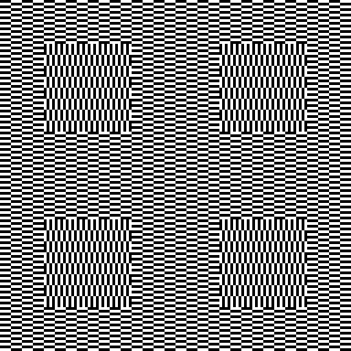

# Ouchi Illusion

## Preview:



## Requirements:
- Python 3
- Python Modules:
    - tkinter
    - pillow
- Tk

## Calculation modes
#### Mode 1

- Only calculates top left quadrant
- Calculates pixels of background pattern (excluding these in square area)
- Calculates pixels of square area
- Copies pixels of top left quadrant to all other quadrants

#### Mode 2 (Default)
- Only calculates top left quadrant
- Calculates all pixels in relation to their position
- Copies pixels of top left quadrant to all other quadrants

#### Mode 3
- Calculates all pixels in relation to their position

## Command line flags
#### ouchi.py
```
ouchi.py [-h] [-e [EXPONENT]] [-m [MODE]]

  -h, --help            show this help message and exit
  -e [EXPONENT], --exponent [EXPONENT]
                        exponent for the image size as power of two (min: 7) (default: 9)
  -m [MODE], --mode [MODE]
                        type of processing mode (1, 2 or 3) (default: 2)
```

#### benchmark.py
```
benchmark.py [-h] [-r [RUNS]] [-e [EXPONENT]] [-m [MODE]]

  -h, --help            show this help message and exit
  -r [RUNS], --runs [RUNS]
                        number of test runs (min: 1, default: 100)
  -e [EXPONENT], --exponent [EXPONENT]
                        exponent for the image size as power of two (min: 7, default: 9)
  -m [MODE], --mode [MODE]
                        processing mode to be tested (1, 2 or 3)
```

## Benchmark

The benchmark was used to determine the fastest mode.

Command used: `python benchmark.py -e 12`

Evaluating to the following settings:
- Runs (per mode): 100
- Image Size: 4096

| Mode | Average | Standard Derivation | Variance |
| --- | --- | --- | --- |
| 1 | 20.722129876613618 | 0.13780810372946542 | 0.0189910734535111 |
| 2 | 17.876957502365112 | 0.15827013924085034 | 0.025049436975318154 |
| 3 | 18.897894926071167 | 0.10632126182157015 | 0.01130421071533087 |
